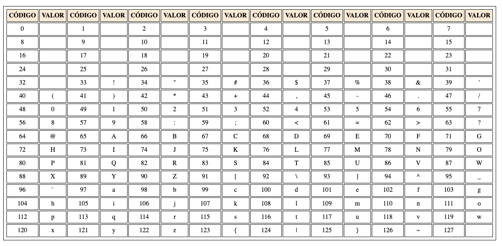

# Conociendo el Lenguaje Php (III)
####  Estructuras de control - [Resumen](cheatSheet.md)

#### Actividades Previas
* Crea una página `indexA.php` que muestre 30 números aleatorios e indique por pantalla si son pares o no
* Crea una página `indexB.php` que muestre los números del 48, 50, 52, 54,……...., 100.
* Crea una página `indexC.php` que calcule la suma de los números comprendidos entre 1 i 1000.
* Crea una página `indexD.php` que muestre los números impares del 1 al 99 indicando al final cuantos son. Repetir para los pares y múltiples de cinco.
* Crea una página `indexE.php` y declara 2 variables A y B (A mayor que B). Visualiza los números desde A hasta B e indica cuantos hay que sean pares.
* Crea una página `indexF.php` y muestra los números del 1 al 1000 indicando al final:
  -  Cuantos números pares hay y su suma.
  -  Cuantos números impares hay y su suma.
  -  Cuantos hay que sean múltiples de 4 y 7 y su suma.

#### Actividad 1
Hacer una página en PHP que para una nota almacenada en una variable,muestre por pantalla lo siguiente:
1. Si la nota es menor que 5 -> “suspenso”
2. Si la nota es 5 -> “aprobado”
3. Si la nota está entre 6 y 7 -> “bien”
4. Si la nota está entre 8 y 9 -> “notable”
5. Si la nota es 10  -> “sobresaliente”

Nota: Las notas < que 5 deben aparecer coloreadas en rojo y las mayores que 5 en verde.

#### Actividad 2
Realizar un script que determine la cantidad total a pagar por una llamada telefónica de acuerdo a las siguientes premisas:
1. Toda llamada que dure menos de 3 minutos tiene un coste de 10 céntimos.
2. Cada minuto adicional a partir de los 3 primeros es un paso de contador y cuesta 5 céntimos.
La duración en segundos de la llamada estará almacenada en una variable.

#### Actividad 3
Escribe un programa en que dado un número aleatorio del 1 a 7 escriba el correspondiente nombre del día de la semana.
Utiiza la setencia switch. utiliza la función [mt_rand()](https://www.php.net/manual/es/function.mt-rand.php).

#### Actividad 4
Realiza un programa que dada una hora contenida en una variable `$hora`, muestre buenos días, buenas tardes o buenas noches según la hora.
Se utilizarán los tramos de 6 a 12, de 13 a 20 y de 21 a 5. Utiliza la funcion [date()](https://www.php.net/manual/es/function.date.php).

#### Actividad 5
Escribe un programa que nos diga el horóscopo a partir de un día y mes aleatorio almacenado en 2 variables `$dia` y `$mes`.
Junto al horóscopo debe aparecer la imagen correspondiente. Puedes encontrar las imágenes en la `/assets/images/horoscopo.
Nota: Puede ser necesario que tengas que renombrar algunas imágenes;

#### Actividad 6
Hacer una página en PHP que muestre una figura similar a la siguiente.
 ```
 @
 @@
 @@@
 @@@@
 @@@@@ 
 @@@@@@
 ```
 
 **NOTA** 
     * Solo está permitido el uso de un * en todo el código.
     * Deberás utilizar 2 bucles `for

#### Actividad 7
* Crea un fitxero `indexA.php` y escribe una página que cada vez que se ejecute muestre un dado con puntación de 1 a 6.
* Crea un fitxero `indexB.php` y escribe una página que cada vez que se ejecute muestre la tirada de 6 dados con puntación del 1 al 6 al azar. Debes usar un `for`.
* Crea un fitxero `indexC.php` y escribe una página que cada vez que se ejecute muestre la tirada de entre 1 y 6 dados al azar.
* Crea un fitxero `indexD.php` y escribe una página que cada vez que se ejecute muestre la tirada de entre 1 y 6 dados al azar. Muestra la puntación obtenida en la tirada.
* Crea un fitxero `indexD.php` y escribe una página que cada vez que se ejecute muestre la tirada de entre 1 y 6 dados al azar. Muestra el número de pares e impares obtenidos.

**Nota:** Las imágenes de los dados las puedes encontrar en `assets/images/dados`.

#### Actividad 8
Se pide realizar un generador para una apuesta del juego de Euromillones que nos permita obtener al azar cinco números
principales (del 1 al 50) y dos números (del 1 al 9) llamados “estrellas”.
Las estrellas las pintaremos en verde mientras que los números en azul.

#### Actividad 9
Escriba un programa que dibuje 30 círculos númerados. Usa la estructura `for`.

#### Actividad 10
Crea una páginas php que muestra todo el código ASCII en una tabla de 16 columnas i 8 filas.
Nota:
1. La función `chr()` recibe un número y muestra el código ASCII equivalente
2. No puedes repetir código.


